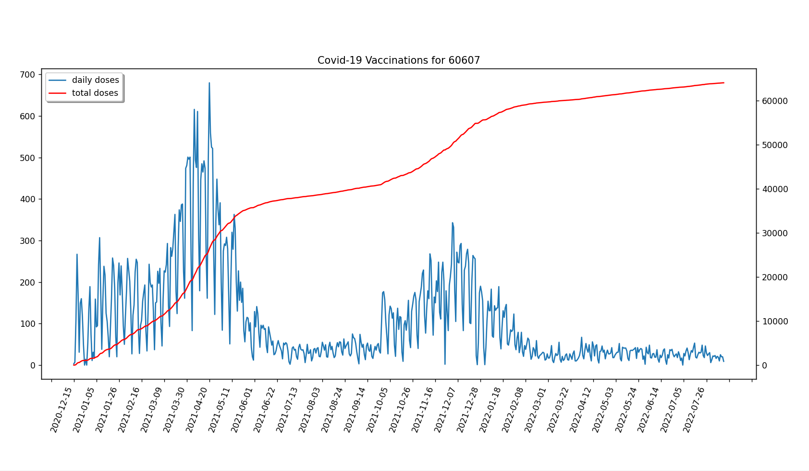

# Chicago COVID-19 Vaccinations
 
A Python program that graphs daily and cumulative Covid-19 vaccination data for a user-entered City of Chicago zip code. The data is requested from data.cityofchicago.org and graphed using Matplotlib.
 
 *Example:*
 

